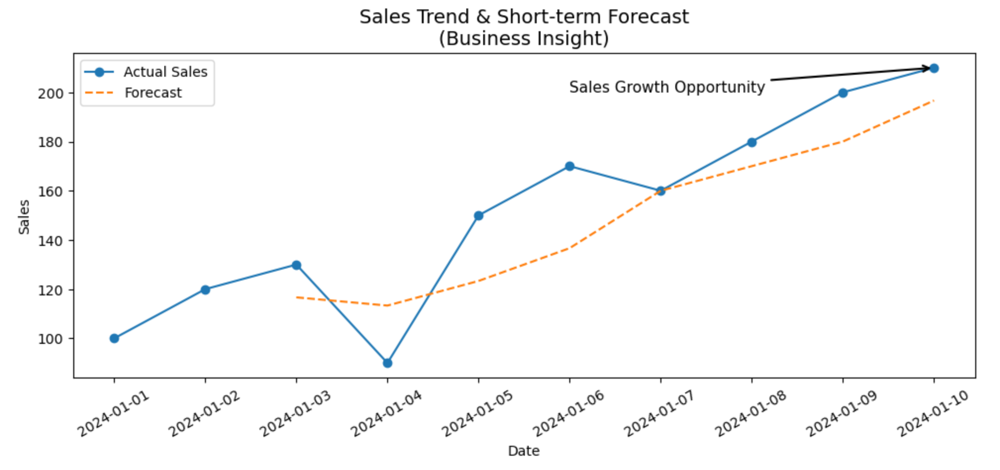

# 📊 Sales Forecast & Business Insight Analysis



---

## 🧠 Project Overview

This project simulates a real-world business scenario where a data analyst is responsible for:

- Monitoring sales performance  
- Detecting anomalies  
- Delivering short-term forecasts  
- Supporting data-driven decision-making  

Using Python, I analyzed time-series sales data and developed a simple forecasting model to uncover trends and highlight growth opportunities.

---

## 🎯 Business Problem

Stakeholders need to:

- Understand recent sales performance  
- Detect unusual fluctuations  
- Anticipate short-term trends for planning  

However, raw data alone makes it difficult to quickly extract actionable insights.

---

## 💡 Solution Approach

I developed a lightweight analytics workflow that:

- Cleans and structures time-series data  
- Visualizes sales trends clearly  
- Applies a rolling average model for forecasting  
- Adds business-focused annotations to highlight insights  

---

## 📊 Key Insights

- Sales show an overall upward trend, indicating business growth  
- A temporary drop in performance is observed mid-period  
- The forecast suggests continued recovery and growth  
- A clear sales growth opportunity is identified at the end of the timeline  

---

## ⚙️ Methodology

The forecast is calculated using a **3-day moving average**:

```python
df['forecast'] = df['sales'].rolling(window=3).mean()
````

This method smooths short-term fluctuations and provides a clear directional trend.

---

## 🛠️ Tools & Skills

* Python (Pandas, Matplotlib)
* Data Analysis & Visualization
* Time Series Analysis (Moving Average)
* Data Storytelling
* Analytical Thinking

---

## 📁 Project Structure

```
Sales-Forecast-Project/
│
├── data/
│   └── sales_time_series.csv
│
├── assets/
│   └── sales_forecast.png
│
├── src/
│   └── forecast.py
│
└── README.md
```

---

## 🚀 How to Run

```bash
git clone https://github.com/rrmao-tech/Sales-Forecast-Business-Insight-Analysis.git
cd sales-forecast-project
pip install pandas matplotlib
python src/forecast.py
```

---

## 📈 Business Impact

This project demonstrates how data analysis can:

* Improve visibility into sales performance
* Support short-term planning and forecasting
* Help stakeholders identify growth opportunities
* Enable data-driven decision-making

---

## 🔮 Future Enhancements

* Implement advanced forecasting models (ARIMA, Prophet)
* Build interactive dashboards (Power BI / Plotly)
* Add anomaly detection alerts

---

## 👤 Author

**PRMAO**
Aspiring Data Analyst
Python | Power BI | Data Storytelling

